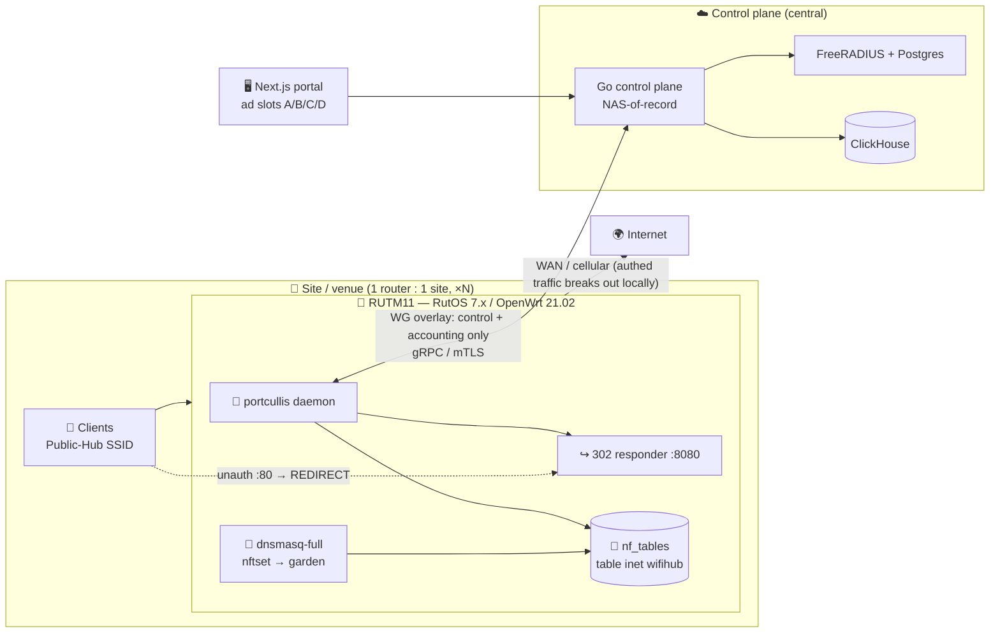
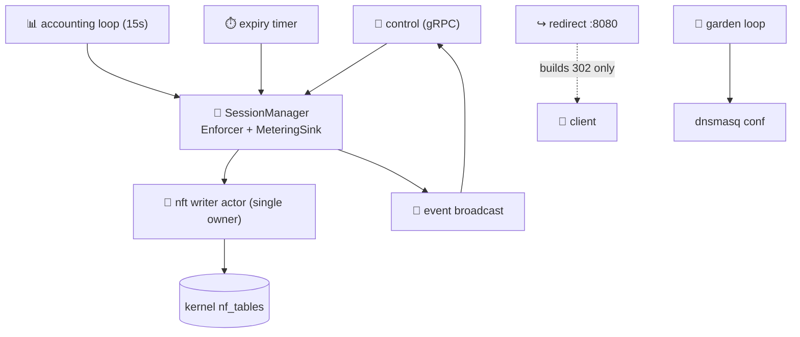
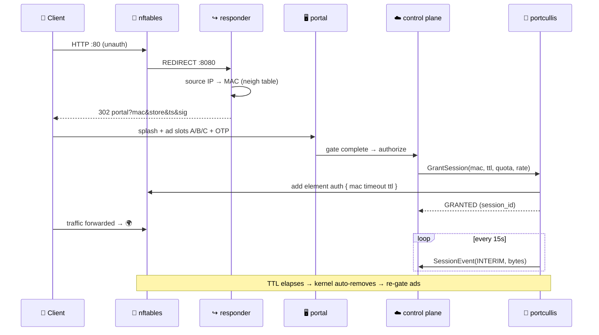

<div align="center">

# 🏰 portcullis

**Per-site captive-portal edge enforcement engine for OpenWrt routers**

*No client reaches the internet until the control plane explicitly authorizes it — and once authorized, the grant is enforced, metered, and expired correctly.*

[](https://github.com/aupv9/portcullis-rust/actions/workflows/ci.yml)


-lightgrey)


</div>

---

## 📖 What is this?

`portcullis` is the **data-plane enforcement arm** of an ad-gated public-WiFi captive portal. It runs locally on each site's OpenWrt router (built for the **Teltonika RUTM11** / RutOS) — one router per site, scaling to thousands of independent sites — and does exactly one job well: hold the internet gate shut until the control plane says open, then enforce / meter / expire that grant.

It is the mechanism behind a **video-gate ad slot**: the moment the gate completes, the control plane calls `GrantSession`, and `portcullis` opens the path.

> 🧭 It is **not** a NAS, **not** an ad renderer, **not** a business-logic owner — see [Boundaries](#-boundaries-what-it-deliberately-does-not-do).

Design notes and the load-bearing invariants are summarized below and in [`CLAUDE.md`](./CLAUDE.md) and the per-area engineering notes in [`.claude/skills/`](./.claude/skills/).

---

## 🌐 Topology



Client **data** breaks out locally at the store's WAN. The WireGuard overlay carries **control + accounting only** — never client traffic. Identity is the client **MAC** (visible at L2 locally), not IP.

---

## ✨ Features

| | Feature | Status |
|---|---|---|
| 🚦 | **Gate enforcement** — drop unauth traffic, redirect `:80`, allow per-session by MAC | ✅ |
| ↪️ | **Signed redirect** — `:8080` 302 to portal with `HMAC-SHA256(mac\|store\|ts)` | ✅ |
| 🌳 | **Walled garden** — pre-auth reachability via dnsmasq `nftset` (portal/OTP/ad/pay + DNS) | ✅ |
| ⏱️ | **Dual-path expiry** — kernel set-element `timeout` + daemon sweep | ✅ |
| 📊 | **Accounting** — per-session bytes from conntrack (correct under NAT), 15 s interims | ✅ |
| 🎯 | **Quota enforcement** — revoke + `QUOTA_EXCEEDED` when bytes exceed quota | ✅ |
| 🔌 | **gRPC control** — `Enforcement` service over **mutual TLS** on WireGuard | ✅ |
| 📡 | **Event stream** — engine → control plane lifecycle events (bounded fan-out) | ✅ |
| ♻️ | **Restart adoption** — rebuild session view from the kernel; no client dropped | ✅ |
| 🛡️ | **Fail-closed everywhere** — no error path ever fails open | ✅ |
| 🪶 | **Embedded footprint** — ~2.4 MB binary, RAM-only state (no flash writes) | ✅ |
| 🚄 | **Rate limiting / shaping** — `tc`/HTB per-tier (Phase-2 skeleton) | 🚧 |
| 📦 | **OpenWrt `.ipk` packaging** — procd init, UCI config, first-boot bootstrap ([`deploy/`](./deploy)) | 🚧 scaffolded |

---

## 🏗️ Architecture

A single Tokio daemon, structured as a Cargo workspace with a **hexagonal** core: every crate depends only on the frozen contract crate `portcullis-types` (data types + port traits); the composition root `portcullis-engined` wires the concrete adapters. This keeps the netfilter-touching code mockable and the domain logic pure.

```
crates/
  🧬 portcullis-types        data types + port traits (the contract hub) — no I/O
  🧱 portcullis-nft          ONLY crate touching netfilter: FirewallBackend, nft -j, writer actor
  🧠 portcullis-session      domain: Session lifecycle, quota, expiry, adoption (pure)
  ↪️ portcullis-redirect     :8080 HMAC-signed 302 responder + neigh MAC lookup
  🌳 portcullis-garden       dnsmasq nftset render + reconcile
  📊 portcullis-accounting   conntrack metering loop + quota trigger + tc shaper
  🔌 portcullis-control      tonic gRPC Enforcement server + mTLS + event fan-out
  ⚙️ portcullis-config       UCI/TOML config: load, validate, hot-reload diff
  🚀 portcullis-engined      composition root: runtime, signals, adoption, shutdown
proto/enforcement.proto      contract shared with the Go control plane
```

### Concurrency model

`SessionManager` is the single point that issues commands to the **nft writer actor** — every netfilter mutation is serialized through one owner, so transactions never race.



---

## 🔄 Key flows

<details open>
<summary><b>1. Grant — client gets internet after the ad gate</b></summary>


Fail-closed: `add_auth` runs **before** the session is recorded — a writer error means no session and no internet.
</details>

<details>
<summary><b>2. Expiry (dual-path)</b></summary>

- **Kernel path (authoritative):** the `auth` set element's `timeout` elapses → kernel removes it → the client's next `:80` is redirected again (re-gate). Works even if the daemon is dead.
- **Daemon path:** `tick_expiry` emits the accounting `EXPIRED` record and best-effort `del_auth`. Neither path alone can strand a "permanent internet" session.
</details>

<details>
<summary><b>3. Revoke</b></summary>

`RevokeSession(mac, reason)` → delete `auth` element → emit `REVOKED` / `QUOTA_EXCEEDED` with final bytes → control plane sends Accounting-Stop.
</details>

<details>
<summary><b>4. Restart adoption (deploy a new build, drop nobody)</b></summary>

On start: `ensure_base` (idempotent) → `list_auth` from the kernel → `adopt` rebuilds the in-RAM session view (no `GRANTED` re-emitted) and re-baselines accounting. The kernel is the source of truth, so an upgrade keeps every authorized client online.
</details>

---

## 🚀 Quick start

> Requires Rust **1.96+** and `protoc` (for the gRPC contract). Host build = CI-equivalent; the ruleset logic is arch-independent (TDD §15).

```bash
# Build & test the whole workspace
cargo build --workspace
cargo test  --workspace          # 130 tests
cargo clippy --workspace --all-targets -- -D warnings

# Run a single crate's tests
cargo test -p portcullis-session expiry

# Run the daemon locally (control level via RUST_LOG; needs nft/ip/conntrack on Linux)
RUST_LOG=debug PORTCULLIS_CONFIG=/etc/config/portcullis cargo run -p portcullis-engined
```

### 📦 Cross-compile for the router (RUTM11)

```bash
# Target: MIPS 1004Kc, little-endian, static musl
cargo build --release --target mipsel-unknown-linux-musl
# Package as an .ipk via the RutOS / OpenWrt SDK (ramips/mt7621) — see .claude/skills/openwrt-build
```

Runtime dependencies on-device: `kmod-nft-*` + `nftables` userspace and `dnsmasq-full` (declared as package deps).

---

## 📡 gRPC API — `wifihub.enforcement.v1`

The engine is the **server**; the Go control plane is the client. See [`proto/enforcement.proto`](./proto/enforcement.proto).

| RPC | Direction | Purpose |
|---|---|---|
| `GrantSession(GrantRequest) → GrantReply` | CP → engine | Authorize a client (mac, ttl, quota, rate, tier) |
| `RevokeSession(RevokeRequest) → Ack` | CP → engine | Admin/fraud/quota revoke |
| `GetSession(Key) → SessionInfo` | CP → engine | Look up one session |
| `ListSessions(ListRequest) → stream SessionInfo` | CP → engine | Snapshot all sessions |
| `StreamEvents(StreamReq) → stream SessionEvent` | **engine → CP** | GRANTED / INTERIM / EXPIRED / REVOKED / QUOTA_EXCEEDED |
| `Health(Empty) → HealthReply` | CP → engine | backend / kernel-table / cp-connected / reconcile flags |

> 🔒 The engine **never speaks RADIUS** — it emits `SessionEvent`s; the control plane (NAS-of-record) translates them to RADIUS Accounting.

---

## ⚙️ Configuration

Sourced from UCI (`/etc/config/portcullis`) or TOML; loaded & validated at startup (`portcullis-config`).

| Option | Example | Hot-reload? |
|---|---|---|
| `store_id` | `SITE-0042` | restart |
| `control_endpoint` | `https://cp.wifihub.internal:8443` | restart |
| `wg_interface` | `wg-hub` | restart |
| `hmac_key_file` | `/etc/portcullis/hmac.key` | restart |
| `responder_port` | `8080` | restart |
| `accounting_interval` | `15` (s) | ✅ hot |
| `default_ttl` | `1800` (s) | ✅ hot |
| `default_quota_mb` | `0` (0 = unlimited) | ✅ hot |
| `default_rate_kbps` | `2048` | ✅ hot |
| `garden_fqdn` | `portal.wifihub.vn` (list) | ✅ hot |

mTLS material is provisioned separately at `/etc/portcullis/tls/` (`server.crt`, `server.key`, `client-ca.crt`) — never baked into the package.

---

## 🔐 Security model

- **mTLS is the gate.** The gRPC server requires a client cert chaining to the control-plane CA (`client_ca_root`); WireGuard is defence-in-depth, not the only gate. No client CA → the server refuses to start (no anonymous fallback).
- **Router-signed identity.** The `:8080` responder signs `HMAC-SHA256(key, "mac|store|ts")`; the portal trusts `mac`/`store` only because the signature validates. The key never reaches the client; verification is constant-time.
- **Hardened attack surface.** The redirect responder reads only the kernel source IP (never client query/body), parses totally and panic-free (cf. openNDS CVE-2023-38314), with per-source rate limiting and a bounded request body.
- **Least privilege.** Runs as a dedicated non-root user with `CAP_NET_ADMIN` only; subprocess args are engine-constructed, never client-interpolated.
- `#![forbid(unsafe_code)]` across all crates — **zero `unsafe`**.

---

## 🧠 Design invariants

> These are load-bearing — violating them causes flash failure, fail-open, or accounting corruption. Enforced by code + tests, and re-checked by [`.claude/agents/portcullis-reviewer`](./.claude/agents) and [`security-auditor`](./.claude/agents).

1. **No fail-open** — every error keeps prior state or fails closed.
2. **No flash writes** — all runtime state in RAM/tmpfs; the kernel + control plane are durability.
3. **Single nft writer** — every mutation funnels through one actor (atomic, ordered).
4. **`accept` is not terminal in nftables** — the `forward` chain *drops* unauth non-garden traffic and lets the rest fall through to fw3.
5. **Kernel-as-truth** — adopt the kernel `auth` set on restart; never flush.
6. **Dual-path expiry** — kernel timeout is the backstop.

---

## 🪶 Performance & footprint

Tuned for the RUTM11 (MIPS 880 MHz, **256 MB RAM**; budgets: <15 MB binary, <30 MB RSS — TDD §14).

| | Before tuning | After |
|---|---|---|
| Release binary (host arm64) | 6.9 MB | **2.4 MB** (−65%) |
| Runtime regex engine | ~290 KiB | **removed** |

Techniques: size-first release profile (`opt-level="z"`, LTO, `codegen-units=1`, `strip`), dropped `tracing-subscriber` `env-filter`, `SessionId` → `Box<str>`, bounded event buffer, allocation-free HMAC signing. See [`.claude/skills/embedded-perf`](./.claude/skills/embedded-perf).

---

## 🧪 Testing

```bash
cargo test --workspace          # 130 unit tests across 9 crates
```

| Crate | Tests | | Crate | Tests |
|---|---|---|---|---|
| types | 7 | | garden | 9 |
| config | 16 | | accounting | 9 |
| nft | 21 | | control | 26 |
| session | 11 | | engined | 1 |
| redirect | 30 | | **total** | **130** |

- **Unit:** pure domain (`session`, `redirect` HMAC/parse) + `nft` against a `MockBackend`.
- **Integration (planned):** Linux netns harness asserts verdicts (unauth→redirect, garden→allow, authed→forward, expired→re-gate, revoked→drop) + fault injection (kill -9 → adoption, CP loss → fail-closed). See [`.claude/skills/netns-harness`](./.claude/skills/netns-harness).
- **On-device:** RUTM11 acceptance (nft-vs-fw3 priorities, conntrack-under-NAT, flash-write audit).

---

## 🗺️ Roadmap

- [x] `deploy/` — procd init, OpenWrt SDK `.ipk` Makefile, UCI config, first-boot `uci-defaults` ([`deploy/`](./deploy))
- [ ] MIPS cross-compile validated on-device + size/RSS validation (`-Z build-std`, RutOS SDK)
- [ ] `tc`/HTB bandwidth shaping (Phase-2)
- [ ] Linux netns integration + fault-injection suite in CI
- [ ] RFC 8910/8908 Captive Portal API (DHCP option 114) alongside CPD redirect
- [ ] Evaluate openNDS-fork (FAS) vs from-scratch — the POC is the go/no-go gate (TDD §17/§18)

---

## 🚫 Boundaries (what it deliberately does *not* do)

- ❌ Speak RADIUS (control plane is NAS-of-record)
- ❌ Ad decisioning / rendering / OTP (portal + ad engine)
- ❌ NAT/masquerade (fw3 already does it) — owns exactly one table, `inet wifihub`
- ❌ Intercept `:443` (CPD probes `:80`; pre-auth `:443` non-garden hits the drop)
- ❌ Fleet orchestration (the engine is a *target* of the control plane's reconcile loop)

---

## 🤝 Contributing

See [`CONTRIBUTING.md`](./CONTRIBUTING.md). TL;DR: keep crates dependent only on `portcullis-types`, respect the [design invariants](#-design-invariants), `cargo test --workspace` + `clippy -D warnings` must stay green, and abstract any Linux-only I/O behind a port trait with a mock.

---

## 📄 License

Licensed under either of

- Apache License, Version 2.0 ([`LICENSE-APACHE`](./LICENSE-APACHE) · <http://www.apache.org/licenses/LICENSE-2.0>)
- MIT license ([`LICENSE-MIT`](./LICENSE-MIT) · <https://opensource.org/licenses/MIT>)

at your option. Unless you explicitly state otherwise, any contribution intentionally submitted for inclusion in this project by you, as defined in the Apache-2.0 license, shall be dual-licensed as above, without any additional terms or conditions.

## 🙏 References

- Teltonika RUTM11 / RutOS (OpenWrt 21.02, kernel 5.4) — `wiki.teltonika-networks.com`
- openNDS (prior art: redirect, walled garden, tmpfs, CPD) — `opennds.readthedocs.io`
- CVE-2023-38314 (openNDS NULL-deref DoS) — the redirect-hardening precedent
