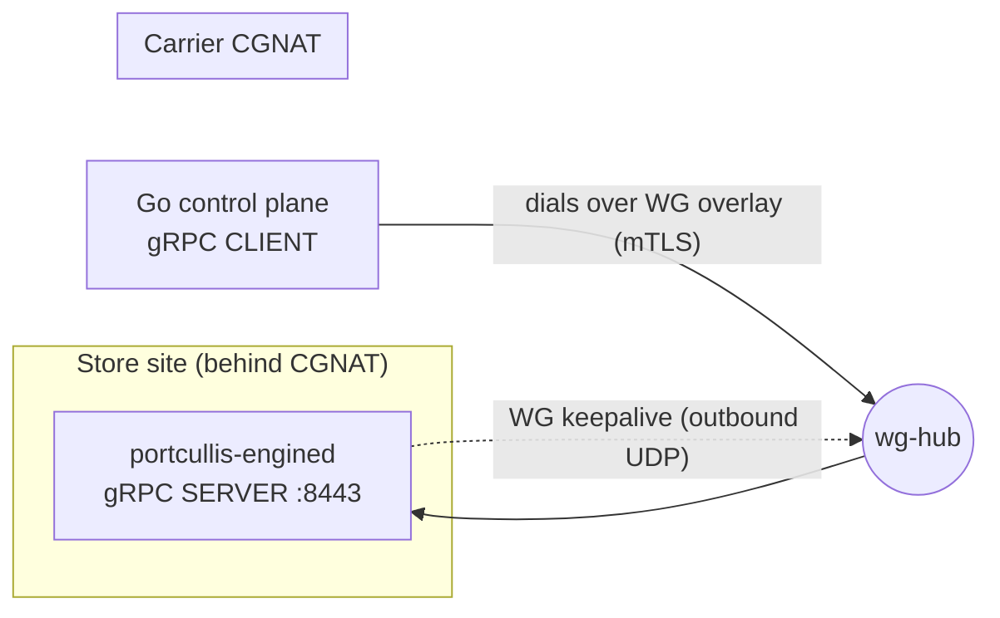
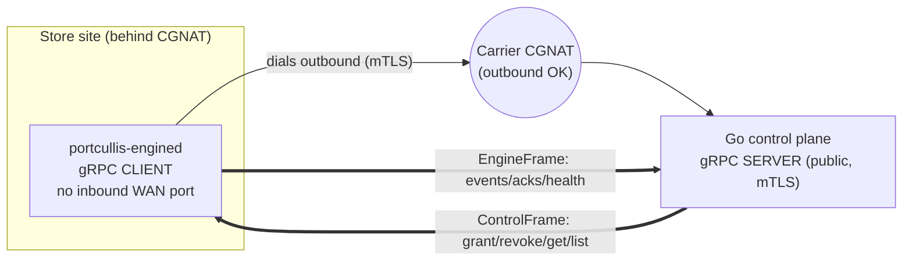
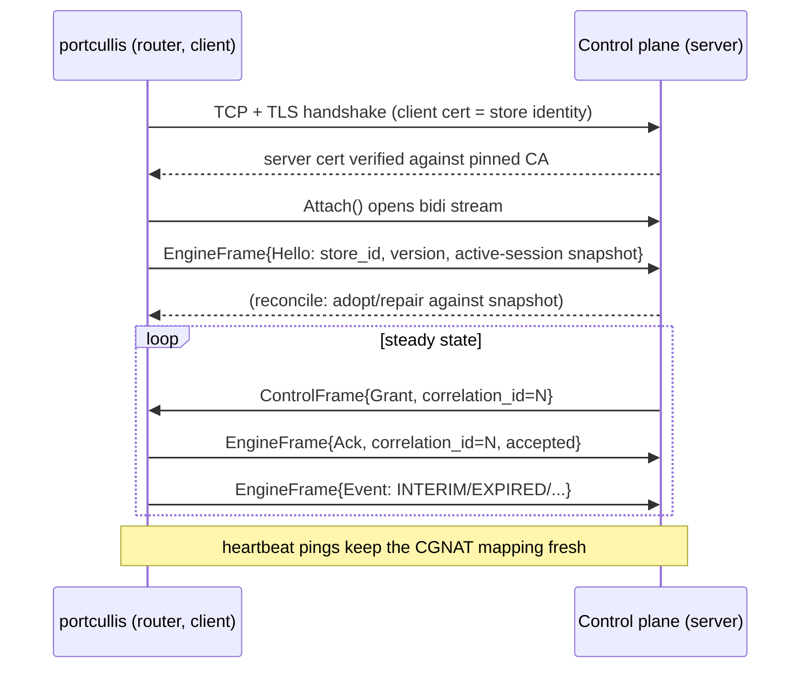

# Design: CGNAT-safe control channel via router-initiated bidirectional gRPC stream

Status: **Implemented (engine/Rust side)** — Go control plane pending.
Supersedes: the WireGuard overlay + "control plane dials the router" model
(the former `portcullis-control` server, `wg_interface` config, mTLS-over-WireGuard).

WireGuard has been removed from the codebase. The engine now dials the control
plane over the `Attach` bidi stream (Phases 0–5 landed: proto, config, control
transport + `channel.rs` driver, engined rewiring, deploy/docs). Phase 6 (netns
E2E against a mock CP server) and the Go control-plane rewrite remain.

---

## 1. Problem

Sites now sit **behind carrier-grade NAT (CGNAT)** and the WireGuard overlay is
being removed from the architecture.

The current model (see `proto/enforcement.proto`, `crates/portcullis-control/src/transport.rs`,
`crates/portcullis-engined/src/compose.rs`) is:

- The **router runs a gRPC server** (`portcullis-control::serve` binds a socket).
- The **Go control plane (CP) is the client** — it *dials into* the router.
- Reachability was provided by **WireGuard**: the router opened an outbound UDP
  tunnel (persistent keepalive), which gave the CP a stable overlay address to
  reach the router's server. mTLS was the actual auth gate; WG was "defence in
  depth" and, critically, the **NAT-traversal mechanism**.

Removing WireGuard removes exactly the thing that let an inbound-unreachable
router be reached. Behind CGNAT the router has:

- no public IP (one public IP is shared across many subscribers),
- no ability to port-forward (the NAT is the carrier's, not ours).

So the CP **cannot** dial the router any more. But — as noted in the request —
**outbound** connections from the router to CP infra are not blocked by CGNAT.

> **Invariant:** behind CGNAT, only the router may *initiate* the connection.
> Any control traffic (grants, revokes) must therefore flow *backwards* relative
> to who dialed.

## 2. Decision

**Invert the gRPC direction.** The router becomes the gRPC **client** and dials
out to the CP's public endpoint over mTLS (no overlay). Control flows over a
single **long-lived bidirectional stream**:

- **CP → router** (down the stream): `GrantSession`, `RevokeSession`,
  `GetSession`, `ListSessions` — modelled as `ControlFrame`s.
- **router → CP** (up the stream): `SessionEvent`s (already streamed today),
  command acks/responses, health — modelled as `EngineFrame`s.

### Why this option

1. **mTLS was always the real gate.** `transport.rs` documents it:
   *"WireGuard narrows the network, mTLS authenticates the principal."* Dropping
   WG does not weaken the auth model — the client cert still gates everything.
2. **Fleet attack surface shrinks.** After inversion the router **exposes no
   inbound WAN port at all**. The redirect responder `:8080` (invariant #8, the
   primary inbound surface) becomes the *only* listener, and it is LAN-only. The
   public endpoint is now the CP's, where we control IP-allowlisting, rate limits
   and a WAF.
3. **Every load-bearing invariant is preserved** (see §6): no-fail-open,
   kernel-as-truth adoption, single nft writer, dual-path expiry — unchanged.
4. **Reuses the existing tonic/proto investment** and the bounded broadcast
   event pipeline. The domain core (`Enforcer`, `SessionManager`) does not change.
5. **Lighter:** one subsystem (WG) removed → lower RSS (matters against the
   <30 MB budget) and simpler first-boot provisioning (only mTLS certs, which are
   already provisioned per store).

### Alternatives considered (rejected)

| Option | Pro | Con — why rejected |
|---|---|---|
| **Reverse tunnel / relay** (frp, yamux, cloudflared) — keep router-as-server | Minimal change to `portcullis-control` | Adds a relay = SPOF + ops burden + extra hop; basically re-introduces a WG-like overlay we just removed |
| **Long-poll / pull** — router polls CP for queued commands | Trivial, xthrough any NAT/proxy | Grant latency = poll interval (user pays, then waits); N× wakeups across thousands of sites |
| **MQTT-over-TLS** (broker) | Broker handles fan-out + offline queue, proven for IoT-behind-NAT | New infra + protocol; CP must bridge MQTT↔RADIUS; discards the typed gRPC contract |

## 3. Architecture

### Before (WireGuard, CP dials router)



### After (router dials CP, bidi stream)



### Runtime shape (single outbound connection)



## 4. Wire protocol

Additive changes only — **never renumber/retype/reuse a field tag** (proto rule,
`enforcement.proto:4`). All existing messages (`GrantRequest`, `RevokeRequest`,
`SessionEvent`, …) are reused verbatim inside the new frames.

> The stream rpc is named **`Attach`**, not `Connect`: a `Connect` rpc collides
> with the tonic client's generated `connect` constructor. `correlation_id` lives
> at the **frame** level (not on individual reply messages).

```proto
service Enforcement {
  // NEW: the engine dials this. Long-lived, bidirectional. The only control path
  // used in production behind CGNAT. The CP (Go) SERVES it; the engine is the
  // CLIENT. Commands travel CP->engine, events engine->CP.
  rpc Attach (stream EngineFrame) returns (stream ControlFrame);

  // The original unary RPCs are retained for on-net / dev / integration tests
  // where the CP can reach the engine directly. Not used behind CGNAT.
  rpc GrantSession (GrantRequest) returns (GrantReply);
  rpc RevokeSession(RevokeRequest) returns (Ack);
  rpc GetSession   (Key)          returns (SessionInfo);
  rpc ListSessions (ListRequest)  returns (stream SessionInfo);
  rpc StreamEvents (StreamReq)    returns (stream SessionEvent);
  rpc Health       (Empty)        returns (HealthReply);
}

// engine -> control plane. correlation_id echoes the ControlFrame being answered
// (0 for unsolicited frames: hello, event, health).
message EngineFrame {
  uint64 correlation_id = 1;
  oneof msg {
    Hello        hello    = 2; // first frame after Attach
    SessionEvent event    = 3; // lifecycle/accounting events (was StreamEvents)
    CommandAck   ack      = 4; // terminal reply to grant/revoke
    SessionInfo  session  = 5; // a row answering get/list
    ListEnd      list_end = 6; // terminates a get/list response
    HealthReply  health   = 7; // reply to a Ping, or periodic
  }
}

// control plane -> engine. correlation_id is echoed back in the answering frames.
message ControlFrame {
  uint64 correlation_id = 1;
  oneof msg {
    GrantRequest  grant  = 2;
    RevokeRequest revoke = 3;
    Key           get    = 4;
    ListRequest   list   = 5;
    Ping          ping   = 6; // heartbeat; engine replies with a HealthReply
  }
}

message Hello {
  string store_id            = 1; // informational only — identity is bound to the cert
  string engine_version      = 2;
  repeated SessionInfo active = 3; // snapshot for CP reconcile on (re)connect (§7.8)
}

message CommandAck {
  bool   ok         = 1;
  string message    = 2; // error detail when !ok
  string session_id = 3; // set for a successful Grant
}

message ListEnd { bool ok = 1; string message = 2; }
message Ping    { int64 ts_unix = 1; }
```

### Correlation & dispatch rules

- Each `ControlFrame` carries a CP-assigned `correlation_id`; every answering
  `EngineFrame` echoes it at the frame level.
- `Grant`/`Revoke` → one `CommandAck`. `Get` → a `SessionInfo` then a `ListEnd`
  (found), or a failed `ListEnd` (missing). `List` → zero-or-more `SessionInfo`
  then one `ListEnd`. `Ping` → a `HealthReply`.
- The engine's command handler calls the **same `Arc<dyn Enforcer>`** as the
  unary path; a validation/enforcer error → `CommandAck{ok:false}` (or a failed
  `ListEnd`) with the error message — never a silent accept (§11 preserved).
- Events (`EngineFrame.event`) are unsolicited and use `correlation_id = 0`.

## 5. Security model

- **mTLS unchanged as the gate**, direction reversed:
  - Engine presents its **client** cert (the current `server.crt/.key` become the
    client identity) and **verifies the CP's server cert against a pinned CA**.
  - The CP **must map the TLS client identity (cert CN/SAN) → `store_id`** and
    **must not trust the `store_id` in `Hello`/`GrantRequest`**. This is the one
    genuinely new security requirement: without WG's network scoping, a
    compromised store cert must not be able to impersonate another store.
- **No inbound WAN listener on the router.** `:8080` redirect responder is the
  only inbound surface and stays LAN-scoped.
- **Public endpoint hardening moves to the CP**: IP allowlist at the edge, per-
  store connection limits, TLS 1.3, cert pinning both directions.
- Cert/key material still provisioned per store at first boot, `0600`, daemon-
  owned; never baked into the `.ipk` (§13) — unchanged.

## 6. Failure semantics — no fail-open (§5, §11) preserved

| Situation | Behaviour |
|---|---|
| Stream/socket down | Keep enforcing existing sessions (kernel `auth` set + timeouts are truth). `cp_connected=false`; increment `CpDisconnect`. |
| New grants while disconnected | **Automatically blocked** — grants can only arrive over the stream, and there is no stream. No code path can accept one. |
| Events while disconnected | Buffered in **bounded RAM** and drained on reconnect. Implemented by holding one long-lived `broadcast::Receiver` across reconnects: the bounded ring buffers up to capacity and drops **oldest** on overflow (`Lagged`), exactly the existing §11 semantics. Accounting-stop delivery stays best-effort; the CP remains the durable source of truth and re-baselines via the `Hello.active` snapshot. |
| Reconnect | Exponential backoff **with jitter** (avoid thundering-herd across thousands of sites reconnecting after a CP blip), capped. On success: send `Hello` with the active-session snapshot → CP reconciles. |
| Malformed `ControlFrame` | Reject that command with `CommandAck{ok:false}`; do **not** tear down the stream or mutate state. |
| CGNAT idle-timeout | HTTP/2 keepalive + app-level `Ping` below the carrier's TCP idle window keep the mapping fresh. |

`cp_connected` moves from the current heuristic (`sink.subscriber_count() > 0`
in `compose.rs`) to being **set directly by the outbound stream task** on
connect/disconnect.

## 7. Implementation plan

Phased; each phase compiles and tests green on the host (`cargo test --workspace`).
TDD per crate as the existing code does.

### Phase 0 — proto contract (coordinate with Go CP team first)
- `proto/enforcement.proto`: add `Attach` rpc + `EngineFrame`, `ControlFrame`,
  `Hello`, `CommandAck`, `ListEnd`, `Ping` (§4). Keep all existing tags.
- Regenerate tonic bindings (`build.rs` already compiles the proto). Confirm the
  Go side regenerates and agrees on frame semantics.
- **Gate:** proto reviewed by `proto-contract-guard` before code depends on it.

### Phase 1 — client transport (`portcullis-control/src/transport.rs`)
- Add `client_tls_config(client_cert, client_key, server_ca, server_name)` →
  `tonic::transport::ClientTlsConfig` (identity + `ca_certificate` +
  `domain_name`). Mirror the existing no-fail-open guards (empty material → error).
- Add `connect(endpoint, tls, keepalive) -> Result<Channel>` building a
  `tonic::transport::Channel` with `http2_keep_alive_interval`,
  `keep_alive_while_idle(true)`, `tcp_keepalive`, connect timeout.
- Keep `serve()`/`tls_config()` for the retained unary path (dev/on-net).
- Unit tests: config builders reject empty/missing material (parallel to the
  existing `tls_config_*` tests).

### Phase 2 — control-channel driver (new `portcullis-control/src/channel.rs`)
- `run_control_channel(cfg, enforcer: Arc<dyn Enforcer>, events: broadcast::Sender<SessionEvent>, metrics, cp_state_cb)`:
  1. **Connect loop** with backoff+jitter; on each attempt build `Channel`
     (Phase 1) + `EnforcementClient`, open `Attach(stream EngineFrame)`.
  2. On open: send `Hello` (store id, version, `enforcer.list()` snapshot).
  3. **Inbound task**: read `ControlFrame`s, dispatch on the oneof to
     `enforcer.grant/revoke/get/list`, map results/errors via the existing
     `status_from_domain` → `CommandAck`/`SessionInfo`/`ListEnd` with the echoed
     `correlation_id`. Reply to `Ping` with `Health`.
  4. **Outbound task**: hold **one** `broadcast::Receiver` for the whole task
     lifetime (survives reconnects → bounded RAM queue, §6), forward `event` →
     `EngineFrame`; also multiplex command responses. Use an mpsc to merge the
     two producers into the single outbound stream.
  5. On disconnect: `cp_state_cb(false)`, `metrics.incr(CpDisconnect)`, back off,
     retry.
- Reuse `convert.rs` mappers (`session_event_to_pb`, `session_info_to_pb`,
  `grant_request_to_params`, …) verbatim.
- Unit tests (against a mock `Enforcer` + an in-memory duplex, no socket):
  grant frame → enforcer.grant called → ack ok; failing enforcer → ack
  `ok:false` with mapped message (no silent accept); malformed frame → ack error,
  stream stays up; event emitted → appears as outbound `EngineFrame`; correlation
  ids echoed; list → N `SessionInfo` + `ListEnd`.

### Phase 3 — config (`portcullis-config/src/lib.rs`)
- Remove `wg_interface` (and its validation + the §9 UCI example line). Update
  `ReloadImpact::diff` (drop the `wg_interface` term).
- Add, all `#[serde(default)]` for backward-compatible parse under
  `deny_unknown_fields`:
  - `cp_server_ca_file` (path to the CA that signs the CP server cert),
  - `cp_server_name` (SNI / cert name to verify),
  - `control_reconnect_max_secs` (backoff cap, default e.g. 60),
  - `control_keepalive_secs` (default e.g. 20 — under typical CGNAT idle).
- `control_endpoint` stays (now a real outbound URL). Tests: update the UCI
  example test + roundtrip + `diff` tests; add parse tests for the new fields.
- **Migration:** old configs carrying `wg_interface` would fail
  `deny_unknown_fields`. Handle by either (a) accepting-and-ignoring `wg_interface`
  for one release, or (b) shipping a `uci-defaults` migration that strips it.
  Recommend (a) for a smooth fleet rollout, with a deprecation warning.

### Phase 4 — composition root (`portcullis-engined/src/compose.rs`, `main.rs`)
- Replace the `serve()` task (step 5) with a `run_control_channel` task fed by
  `w.event_tx` and `w.mgr as Arc<dyn Enforcer>`.
- `load_tls()` → load **client** identity (`client.crt/.key`) + **server CA**
  (`cp-ca.crt`); if absent, run without the control channel (fail closed: keep
  enforcing, no new grants) — same policy as today's `Ok(None)` branch.
- Wire `cp_connected` from the channel task's connect/disconnect callback; delete
  the `subscriber_count() > 0` heuristic in the reconcile/poll task (step 9b).
- `grpc_listen_addr` removed. Decide the **metrics endpoint** bind: it used the WG
  address; now bind **loopback** (`127.0.0.1:metrics_port`) for local scrape, or
  fold key health into the `Health` frame. Recommend loopback + note the change.

### Phase 5 — deploy (`deploy/`)
- `uci-defaults/99-portcullis`, `config/portcullis`: drop WG interface setup; add
  the new cert/CA paths + endpoint.
- procd init: no dependency on `wg-hub` being up before start.
- `Makefile`/`PACKAGING.md`/`README.md`: remove `wireguard-tools` /
  `kmod-wireguard` deps; document the new outbound-only model + firewall note
  (allow egress to CP; no inbound rule needed).
- Update `netns-harness` and `openwrt-build` skill docs where they mention WG.

### Phase 6 — integration tests (`netns-harness`)
- Add a **mock CP gRPC server** (serves `Attach`) as a test fixture.
- Assert end-to-end over a real socket: router dials → `Hello` snapshot received
  → CP sends `Grant` → engine authorizes (ruleset verdict flips unauth→forward) →
  `Ack ok` → CP sends `Revoke` → dropped.
- **No-fail-open / reconnect:** kill the mock CP mid-session → existing session
  stays authorized (kernel truth), `cp_connected=false`, events buffer; restart
  CP → engine reconnects, re-sends `Hello` snapshot, buffered events drain.

## 8. Risks & open questions

1. **Event durability across long disconnects.** Bounded broadcast drops oldest
   under sustained disconnect — an `EXPIRED`/`QUOTA_EXCEEDED` event could be lost
   for billing. Mitigated by CP re-baselining from `Hello.active` on reconnect;
   if stricter accounting is required, upgrade to a persistent (still
   RAM/tmpfs-only, never flash — invariant #1) sequence-numbered queue with CP
   acks. **Decision needed** with the billing/RADIUS-accounting owners.
2. **Cert→store binding on the CP.** Load-bearing for tenant isolation; must be
   enforced in the Go server, not here. Flag in the proto review.
3. **Retained unary RPCs.** Keep them for dev, or delete to shrink surface?
   Recommend keeping behind the same mTLS, bound to loopback in prod.
4. **Thundering herd.** Thousands of routers reconnecting after a CP restart —
   backoff jitter is mandatory, and the CP edge needs accept-rate limiting.
5. **Metrics reachability.** Losing the WG overlay removes the scrape path;
   confirm the ops story (loopback scrape via a local exporter vs. push).

## 9. Summary of touched surfaces

| Crate / path | Change |
|---|---|
| `proto/enforcement.proto` | +`Attach` rpc, +frame/Hello/Ack messages (additive) |
| `portcullis-control` | server → **client**; new `channel.rs` driver; `client_tls_config`; keep unary server for dev |
| `portcullis-config` | −`wg_interface`; +CP CA / server-name / keepalive / backoff fields; migration |
| `portcullis-engined` | swap serve task for connect-loop task; client TLS load; `cp_connected` wiring; metrics bind |
| `deploy/*` | drop WireGuard packaging + init deps; new provisioning + firewall docs |
| netns integration | mock CP server; grant/revoke/reconnect/no-fail-open E2E |
| **unchanged** | `portcullis-session`, `-nft`, `-accounting`, `-garden`, `-redirect`, all safety invariants |
