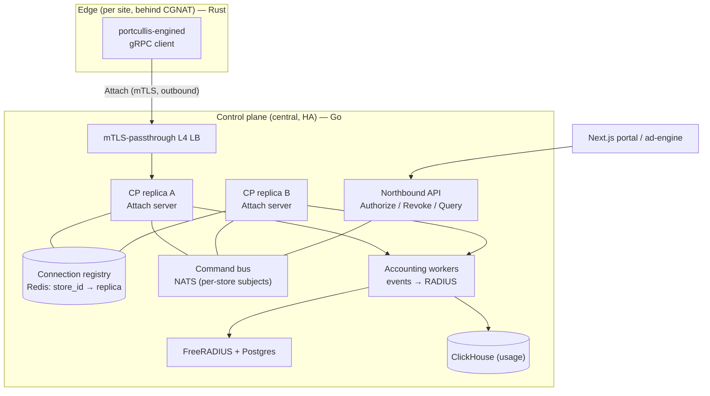
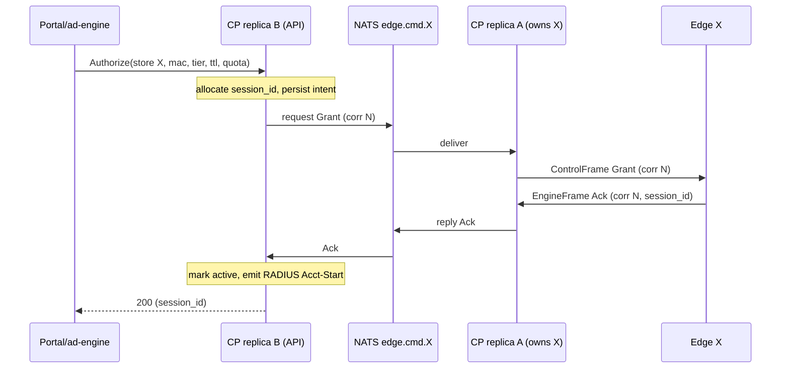

# Design: Control plane + edge architecture (post-CGNAT-inversion)

Status: **Proposed** — CP is to be (re)implemented in Go against this design.
Companion to: [`cgnat-bidi-control-channel.md`](./cgnat-bidi-control-channel.md)
(the transport/contract). This doc covers the **system**: how the Go control
plane (CP) and the `portcullis` edge engine now fit together after WireGuard was
removed and the control direction inverted.

---

## 1. What changed, and why the CP must be redesigned

Before: the CP was the gRPC **client** and dialed each router's server over a
WireGuard overlay. That model is gone. Now:

- The **edge is the gRPC client**; it dials the CP and holds one long-lived
  `Attach` bidirectional stream (CGNAT — the router has no inbound reachability).
- The **CP is the gRPC server**, terminating thousands of persistent inbound
  streams, and must *push* commands down the stream that belongs to a given store.

That inversion breaks every assumption in the old CP:

1. The CP can no longer "dial store X" — it must **find the open stream** for
   store X and write to it. Across multiple CP replicas, that stream lives on
   exactly one replica.
2. Store **identity** is no longer "the WG peer IP" — it is the **mTLS client
   certificate**. The CP must bind cert → `store_id` and trust nothing else.
3. Command/response is now **framed and correlated** over a stream, not a unary
   RPC. The CP owns `correlation_id` allocation and a pending-request table.
4. On every (re)connect the edge sends a **`Hello` snapshot**; the CP must
   **reconcile** it against its own record (the kernel-as-truth adoption path,
   now over the wire).

This document specifies the CP internals to satisfy those, plus the small edge
expectations they imply.

## 2. Goals / non-goals

**Goals**
- Terminate ~10³–10⁴ edge streams across a horizontally-scaled CP; deliver a
  command to the one replica holding the target store's stream.
- mTLS identity → `store_id`, hard tenant isolation.
- Correct RADIUS accounting (CP is NAS-of-record) from edge `SessionEvent`s.
- No-fail-open preserved end to end; CP restarts / edge reconnects drop nobody.
- A clean northbound API for the portal / ad-engine to authorize a client.

**Non-goals**
- Ad decisioning, OTP, rendering (portal + ad-engine).
- Data-plane enforcement (that is the edge's job; CP never sees client traffic).
- Changing the wire contract beyond the additive items flagged in §7.

## 3. System overview

Component ownership:

| Concern | Owner |
|---|---|
| Enforcement, metering source-of-truth | **Edge** (kernel `auth` set) |
| Authorization source-of-truth, session_id issuance, RADIUS | **CP** |
| Which replica holds store X's stream | **Connection registry** (Redis) |
| Delivering a command to that replica | **Command bus** (NATS) |
| Grant origination | **Northbound API** ← portal/ad-engine |

## 4. Identity & trust (the load-bearing change)

- The edge presents a **per-store client certificate** on the `Attach` dial. The
  CP terminates mTLS (verifying against the edge-fleet CA) and derives
  `store_id` from the cert **CN / SAN** — this is the *only* trusted identity.
- `Hello.store_id`, `GrantRequest.store_id`, `SessionEvent`… are **advisory**.
  The CP MUST reject/ignore any frame whose asserted store disagrees with the
  cert identity. A compromised store cert can impersonate **only** its own store.
- The LB must be **TLS-passthrough** (L4) so the client cert reaches the CP
  replica; terminating mTLS at the LB would lose the identity (or require the LB
  to forward it in a trusted header — avoid).
- Cert lifecycle: short-lived leaf certs + rotation; a CRL/OCSP or a
  short-TTL-re-issue story so a revoked store is cut off. Flagged in §12.

## 5. CP internal architecture

### 5.1 Attach server (per replica)

One goroutine per accepted stream. On stream open:
1. Extract `store_id` from the verified client cert.
2. Read the first frame; require it to be `Hello`. Validate `Hello.store_id`
   matches the cert (else close).
3. **Register** ownership: `SET registry[store_id] = {replica_id, epoch, ts}`
   (epoch = monotonic connect counter; last-writer-wins resolves a reconnect
   that raced onto another replica — the older stream's writes are fenced).
4. **Subscribe** on the bus to this store's command subject (`edge.cmd.<store_id>`).
5. Run the **reconcile** pass from `Hello.active` (§5.4).
6. Enter the multiplex loop: fan `ControlFrame`s from the bus → stream; route
   `EngineFrame`s from the stream → pending-request table (acks) or the events
   pipeline (unsolicited).
7. Send `Ping` on an interval; treat a missing `HealthReply` / read error as a
   dead stream → unsubscribe, delete registry entry (if still ours by epoch),
   let the edge reconnect.

Idle streams are cheap (goroutine + buffers); a replica holds tens of thousands.

### 5.2 Command routing across replicas (the crux)

The stream for store X lives on one replica; a command for X may originate on any
replica (northbound API call, a revoke job, a reconcile action). Resolution:

**Recommended: NATS request/reply, per-store subject.**
- The replica that owns X's stream subscribes `edge.cmd.X`.
- Any component sends a command with `nats.Request("edge.cmd.X", ControlFrame)`
  and awaits the reply (the edge's `CommandAck`/`SessionInfo`/`ListEnd`, relayed
  back by the owning replica). NATS does the routing — no manual replica lookup
  on the hot path.
- The Redis registry is then for **liveness/observability + duplicate-connection
  detection**, not routing. (If a store has no subscriber, `Request` times out →
  "edge offline", handled as §8.)

**Alternatives considered:** (a) sticky-by-store LB for both ingress paths — hard
with mTLS passthrough + a separate API ingress; (b) direct inter-replica gRPC
using the registry to find the owner — works but re-implements discovery,
retries, and failover that the bus gives for free. Recommend the bus; a single
replica (no bus) is acceptable only for an MVP/pilot.

### 5.3 Command dispatch & correlation

- The **owning replica** allocates `correlation_id` per outbound `ControlFrame`
  (monotonic per stream), records it in a pending map with a deadline, and
  resolves it when the matching `EngineFrame` arrives (`Ack` for grant/revoke;
  `SessionInfo…ListEnd` for get/list; `HealthReply` for ping).
- Timeout → fail the request (do not assume success). The edge is idempotent on
  re-grant (same `session_id`) so a retry after an ambiguous timeout is safe.
- `CommandAck{ok:false}` is a definitive rejection (validation/enforcer error) —
  surface it to the caller; never treat it as success.

### 5.4 Reconcile on (re)connect (kernel-as-truth over the wire)

`Hello.active` is the set of sessions the edge is currently enforcing. The CP
diffs it against its own "active for store X" record:

| Case | CP action |
|---|---|
| In edge **and** CP-active | Keep; re-baseline accounting counters from the snapshot. |
| In edge, **not** in CP (known `session_id`) | **Adopt** — the edge survived a restart; resume accounting. |
| In edge, **unknown** `session_id` | Policy: **revoke** (safer for public wifi) — the CP has no authorization record. |
| In CP-active, **not** in edge | Edge dropped it (expiry/restart) → emit **Accounting-Stop**, mark ended. |

This mirrors the engine's own `UnknownKernelPolicy`; the edge already sends the
snapshot in `Hello`. No new proto needed.

### 5.5 Events → RADIUS pipeline

`EngineFrame.event` (`GRANTED`/`INTERIM`/`EXPIRED`/`REVOKED`/`QUOTA_EXCEEDED`)
→ owning replica normalizes (attach `store_id`, `session_id`) → append to a
durable queue (JetStream/Kafka) keyed by `session_id` → accounting workers map to
RADIUS Accounting **Start/Interim/Stop** and persist usage to ClickHouse.

- **Idempotency:** dedup by `(session_id, kind, ts_unix)` (events can be re-seen
  after a reconnect). RADIUS Acct is naturally idempotent on `Acct-Session-Id`.
- `session_id` **==** RADIUS `Acct-Session-Id` (issued by the CP at grant).
- The edge **never speaks RADIUS**; only the CP does.

### 5.6 Northbound API (grant origination)

Portal/ad-engine calls a CP API (gRPC or REST) — **not** the edge:
`Authorize(store_id, mac, tier, ttl?, quota?, rate?) → {session_id}` and
`Revoke(store_id, mac, reason)`, `GetSession`, `ListSessions`. The CP validates,
allocates `session_id`, routes the `ControlFrame` (§5.2), and returns only after
the edge acks (or fails fast if the edge is offline, §8). The portal trusts the
signed-redirect tuple (`mac|store|ts|sig`) validated against the store's HMAC —
that binding is unchanged by this redesign.

## 6. Edge (portcullis) responsibilities — recap + required changes

Already implemented (this repo): dial + reconnect with backoff/jitter, `Hello`
snapshot, inbound command dispatch to the `Enforcer`, event pump over a bounded
broadcast, `cp_connected` health, no-fail-open. **No edge code change is required
for the v1 CP design.** Two optional co-design items (§7, §9) touch the edge.

## 7. Contract changes implied (all additive; keep field tags)

- **v1: none.** The current `Attach`/frames/`Hello` are sufficient.
- **Optional (event durability, §9):** add `uint64 seq` to `SessionEvent` and an
  `EventAck { uint64 up_to_seq }` variant to `ControlFrame` for cumulative acks.
- **Optional (observability):** add fields to `Hello` (uptime, ruleset digest) to
  sharpen reconcile.

Any change ships to the Go CP and the Rust edge independently across a fleet
mid-rollout, so both old and new must interoperate — additive only.

## 8. Failure modes — no-fail-open end to end

| Situation | Edge | CP |
|---|---|---|
| Edge ↔ CP stream down | Keep enforcing existing (kernel truth); buffer events (bounded RAM); **no new grant can arrive** | `Request` to `edge.cmd.X` times out → Authorize returns "store offline" (do **not** fake success); existing RADIUS sessions untouched |
| CP replica crash | Stream drops → edge reconnects (backoff+jitter) to another replica → re-`Hello` → reconcile | Registry entry TTL-expires; bus subscription gone; another replica re-owns on reconnect |
| CP fully down | Enforce existing, block new grants, queue events | — |
| Command times out | idempotent on retry (same `session_id`) | Fail the API call; caller may retry |
| Reconnect storm (CP restart) | jittered backoff per store | LB/API accept-rate limiting; NATS absorbs fan-in |
| Duplicate stream (reconnect raced two replicas) | one outbound stream only | epoch fencing in registry; older stream's writes rejected |

## 9. Event delivery semantics — decision needed

The edge buffers events in **bounded RAM, drop-oldest** (no persistence — flash
writes are forbidden). Under a long disconnect an `EXPIRED`/`QUOTA_EXCEEDED`
could be dropped before the CP sees it.

- **v1 (recommended): reconcile-based.** Rely on §5.4: on reconnect the CP
  synthesizes `Stop` for sessions the edge no longer has, and adopts current
  ones. Interim byte granularity may be lost during an outage, but final usage is
  bounded and no session is stranded. Simplest; matches today's edge.
- **v2 (if billing needs it): at-least-once.** `seq` + cumulative `EventAck`
  (§7); the edge keeps unacked events (still RAM-bounded, prioritizing terminal
  events over interims). More proto + edge work.

**Owner decision:** billing/RADIUS-accounting team picks v1 vs v2 based on how
much interim-usage loss during an edge outage is tolerable.

## 10. State ownership & data model

| State | Home | Durability |
|---|---|---|
| `auth` set (who is allowed now) | Edge kernel | RAM + set-element timeout |
| Authorization record, `session_id`, quota/tier | CP DB (Postgres) | durable |
| store_id → owning replica | Redis registry | ephemeral (TTL + heartbeat) |
| Usage / accounting | RADIUS/Postgres + ClickHouse | durable |
| In-flight command correlation | Owning replica memory | ephemeral |

The CP is authoritative for *authorization*; the edge kernel is authoritative for
*current enforcement*. Reconcile bridges the two on every connect.

## 11. Scale

- ~10⁴ mostly-idle HTTP/2 streams per region: comfortable for Go (goroutine +
  small buffers); shard across replicas as the fleet grows.
- Heartbeats at ~20 s → ~500 pings/s at 10k streams — negligible.
- NATS subjects scale to millions; one subject per store is fine.
- Real pressure points: **reconnect storms** (mitigated by edge jitter + CP
  accept limiting) and the **accounting write path** (mitigated by the durable
  queue decoupling ingest from RADIUS/ClickHouse writes).

## 12. Security

- **mTLS both ways**, TLS 1.3, modern ciphers; edge pins the CP CA, CP pins the
  fleet CA. Cert → `store_id`; no header-trust.
- **Cert lifecycle:** short-lived leaves + rotation; revocation via CRL/OCSP or
  short re-issue TTL so a compromised store is cut off promptly.
- **Public endpoint hardening:** per-store connection cap (one active stream),
  global accept-rate limit, SYN/connection flood protection, and a WAF/edge in
  front. The router exposes **no** inbound port — the whole inbound surface moved
  here, so it must be hardened accordingly.
- **Tenant isolation:** enforced by cert→store binding (§4); audited so no
  code path lets store A act on store B.
- Secrets (fleet CA key, RADIUS secret) in a vault, never in images.

## 13. Rollout

1. Stand up the CP `Attach` server (single replica) + northbound API against a
   staging edge — validates the contract end to end (this is also Phase 6 of the
   edge doc: a real `Attach` client ↔ server).
2. Add Redis registry + NATS command bus; scale to 2+ replicas; test reconnect,
   replica-crash re-ownership, and cross-replica grant routing.
3. Wire the events→RADIUS pipeline; verify accounting Start/Interim/Stop and
   reconcile-synthesized Stops.
4. Fleet: provision per-store client certs + `cp-ca.crt`; migrate stores off the
   old WG path (they simply start dialing the new endpoint).

## 14. Open questions

1. **Event durability** v1 vs v2 (§9) — billing owner decides.
2. **Command bus choice:** NATS (recommended) vs Redis Streams vs direct
   inter-replica gRPC (§5.2).
3. **Unknown-session reconcile policy** (§5.4): revoke vs adopt — confirm the
   public-wifi safety stance.
4. **Cert revocation mechanism** (CRL/OCSP vs short-TTL re-issue) and rotation
   cadence.
5. **Northbound API shape:** gRPC vs REST for the portal/ad-engine.
