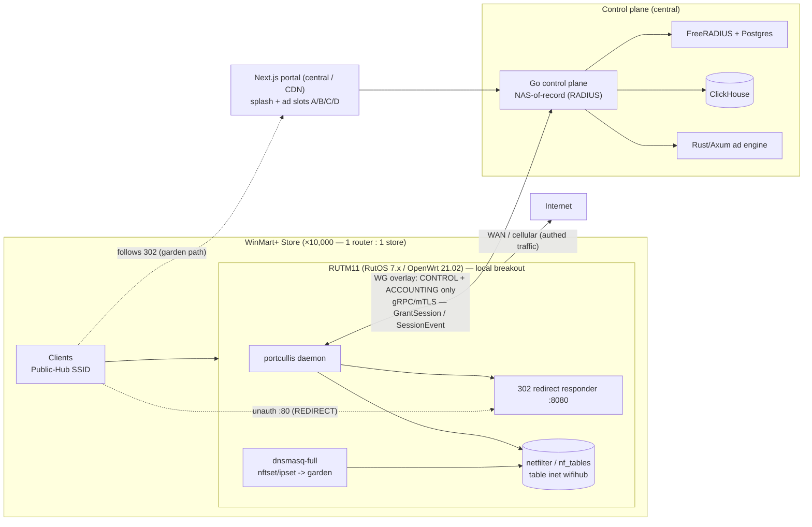
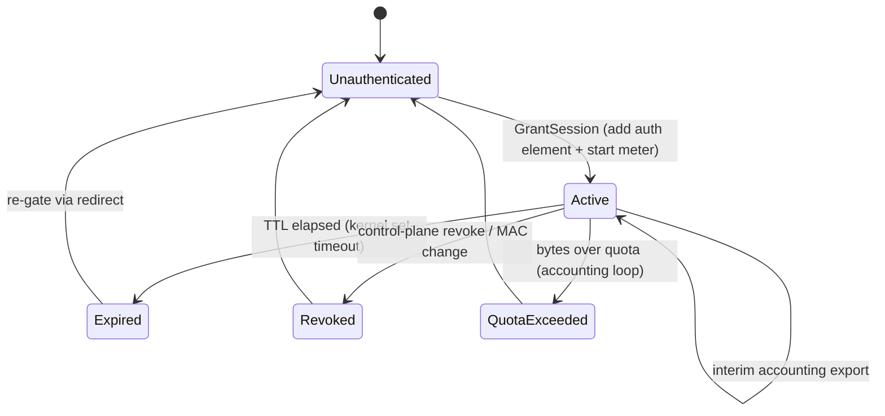
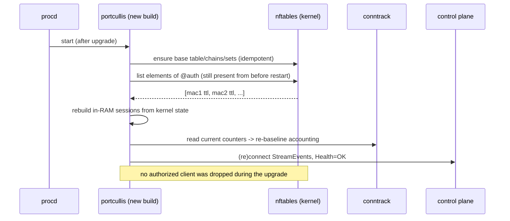
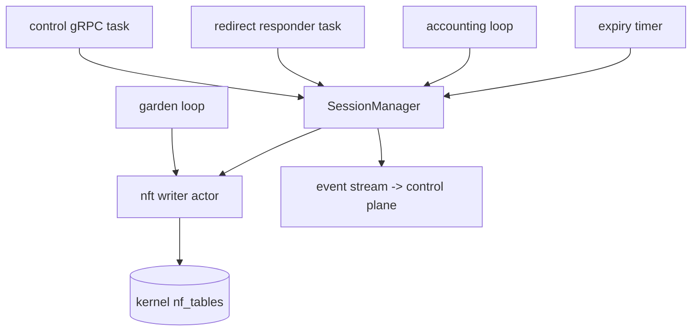
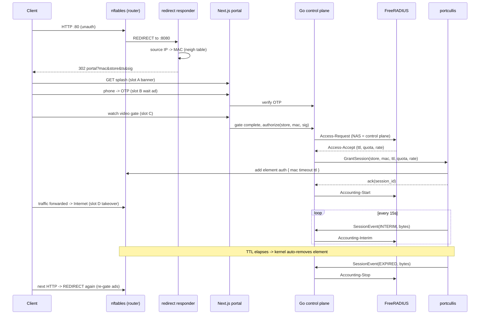

# TDD — `portcullis`: Per-Store Edge Enforcement Engine

| | |
|---|---|
| **Component** | WiFi Hub — Captive Portal Data-Plane Enforcement Engine |
| **Codename** | `portcullis` |
| **Status** | DRAFT v0.1 |
| **Owner** | AUPHAN — New Era (newera.inc) |
| **Deployment target** | Teltonika RUTM11 (RutOS 7.x), 1 instance per WinMart+ store (~10,000) |
| **Upstream system** | WiFi Hub (Go control plane, FreeRADIUS, ClickHouse, Rust/Axum ad engine, Next.js portal) |
| **Related decisions** | Abandon CoovaChilli; no Teltonika RMS; control plane is NAS-of-record |

---

## 1. Overview & Purpose

`portcullis` is the **data-plane enforcement arm** of the WiFi Hub captive portal. It runs locally on each store's RUTM11 router and is responsible for one job: **no client reaches the internet until the control plane explicitly authorizes it**, and once authorized, the grant is enforced, metered, and expired correctly.

It is *not* a NAS in the RADIUS sense, *not* an ad renderer, and *not* a business-logic owner. Those live elsewhere:

- **Go control plane** — NAS-of-record (the only component that speaks RADIUS to FreeRADIUS), session policy, fleet orchestration.
- **Next.js portal + Rust/Axum ad engine** — ad slots A/B/C/D, OTP, video gate.
- **`portcullis`** — intercept unauthenticated traffic, redirect to the portal, hold the gate, open it on command, meter usage, close it on expiry/quota/revoke.

The engine is the mechanism behind **ad slot C** (the video gate): the moment the gate completes, the control plane calls `GrantSession`, and `portcullis` is what actually opens the internet path.

## 2. Scope

**In scope**

- nftables ruleset ownership for the captive portal (DNAT redirect, walled-garden bypass, per-session allow).
- Local client identity capture (MAC) and a redirect responder that hands identity to the portal.
- Session grant / revoke / expiry, driven by the control plane over the WireGuard overlay.
- Per-session accounting (byte/packet metering) and quota enforcement.
- Per-session / per-tier rate limiting (bandwidth shaping).
- Reconciliation and self-healing of the ruleset; safe behaviour across daemon restart and router reboot.
- Packaging and deployment as an OpenWrt package, integrated into the existing fleet-provisioning pipeline.

**Out of scope**

- RADIUS protocol handling (control plane).
- Ad decisioning / rendering / OTP (portal + ad engine).
- Certificate authority / EAP-TLS provisioning for Home-Hub / Retail-Hub tiers (separate workstream).
- Fleet-wide desired-state reconciliation logic (control plane's reconciliation loop; `portcullis` is a target of it, not the engine of it).

## 3. Context & Background

WiFi Hub provides ad-gated public WiFi (Public-Hub SSID) across ~10,000 WinMart+ stores. The monetization model is four ad slots; the internet grant after the video gate (slot C) is the "reward". Earlier work established three SSID tiers and a self-hosted control plane (no RMS dependency). CoovaChilli was abandoned after a confirmed Teltonika-specific segfault and excessive setup complexity, in favour of a **custom DNAT + nftables + control-plane** architecture.

**Topology (corrected, per-store edge):** 1 router serves exactly 1 store. Client internet traffic **breaks out locally** at the store via the router's WAN/cellular uplink. The WireGuard overlay carries **control + accounting only** (engine ↔ control plane), never client data. This eliminates any central bandwidth bottleneck and any per-store subnet-overlap problem, and lets the engine enforce by **client MAC** (visible locally at L2), rather than by IP.



## 4. Goals / Non-Goals

**Goals**

- **G1 — Correctness over cleverness.** No client gets internet without an explicit grant; expired/revoked/quota-exhausted sessions lose access promptly and provably.
- **G2 — Fail-safe.** If the engine crashes or the control plane is unreachable, the system must *not* fail open (grant everyone) and must *not* lose currently-authorized users unnecessarily.
- **G3 — Embedded-friendly.** Run within RUTM11 resource limits (256 MB RAM, 256 MB NAND) without wearing out flash.
- **G4 — Fleet-deployable.** Ship and configure 10k identical instances through the existing provisioning pipeline.
- **G5 — Observable.** Per-store metrics and logs sufficient to debug a single store remotely.

**Non-Goals**

- Sub-millisecond rule-update latency (per-store churn is tiny; see §14).
- Surviving a full router reboot with sessions intact (clients lose connectivity on reboot anyway → natural re-auth).
- Being a general-purpose firewall manager (it owns one table, for one purpose).

## 5. Platform Constraints & Firewall-Backend Decision

This section is load-bearing and reflects verified facts about the target hardware/firmware. It changes several "obvious" assumptions.

### 5.1 Hardware (RUTM11)

| Property | Value | Implication |
|---|---|---|
| CPU | MediaTek dual-core, 880 MHz, **MIPS 1004Kc** (MT7621-class, little-endian) | Rust target is **`mipsel-unknown-linux-musl`**, a far less-travelled target than ARM. |
| RAM | 256 MB DDR3 | Adequate for a lean Tokio daemon; budget conservatively. |
| Flash | 16 MB NOR + 256 MB NAND | Binary fits, **but writing session state to flash is dangerous** (see §5.4). |

### 5.2 Firmware / OS

RutOS 7.x is **OpenWrt 21.02-based, Linux kernel 5.4.147**. This is decisive:

- **OpenWrt 21.02's native firewall is `firewall3` (fw3), which is iptables/xtables-based. There is no `firewall4`/nftables here** — fw4 became default only in OpenWrt 22.03.
- The kernel (5.4) *does* contain `nf_tables` support, but the `kmod-nft-*` modules and the `nftables` userspace binary are **separate packages** that must be present. They are **not guaranteed to be in Teltonika's stock RutOS image/feed.**

**Consequence:** building an nftables-native engine on RutOS 21.02 means running **two firewall subsystems side by side** — the system's iptables/fw3 *and* our `nf_tables` table. This is technically valid (netfilter multiplexes both at the hooks, ordered by priority) but is non-standard and adds operational risk. It is the single biggest risk in this design (§18, §Alternatives).

### 5.3 Custom-package feasibility (positive)

The **RutOS SDK exists and is a standard OpenWrt buildroot** (`./scripts/dockerbuild make pm` produces `.ipk` packages under `bin/packages/<arch>/`). So we can:

- Build `kmod-nft-*` + `nftables` for the `ramips/mt7621` target if they are absent from the stock feed.
- Build and package `portcullis` itself as an `.ipk` with a procd init script.

The friction is the **Rust + MIPS + musl + OpenWrt-SDK** combination, not packaging per se. Confirm std/tier availability for `mipsel-unknown-linux-musl`; budget for building `std` yourself and linking against the SDK's musl toolchain. This is meaningfully harder than the equivalent ARM path on, e.g., RUTX-series (ipq40xx, ARM Cortex-A7).

### 5.4 Flash wear (hard constraint, evidenced by prior art)

openNDS — the canonical OpenWrt captive portal — documents this explicitly: using the router's built-in flash for runtime state *"would cause excessive wear and in a live system will result quite quickly in flash failure making the router useless."* It keeps runtime state in **tmpfs**.

**Decision:** `portcullis` keeps **all runtime/session state in RAM (tmpfs)**. Durability is provided by (a) the kernel holding the nftables ruleset across daemon restarts, and (b) the control plane as the ultimate source of truth (§7.8). No `redb`/sqlite-on-flash.

### 5.5 Firewall-backend library decision

| Option | Pros | Cons | Verdict |
|---|---|---|---|
| `nftables-rs` (drives `nft -j` JSON) | Pure-Rust (no C link) → easiest MIPS cross-compile; atomic transactions; trivially debuggable (log the JSON) | Requires `nft` binary present at runtime; fork/exec per batch | **Recommended.** Per-store churn is tiny so fork/exec is irrelevant; the easy cross-compile is the deciding factor on MIPS. |
| `rustables` (netlink via libmnl/libnftnl) | No `nft` binary needed; lowest overhead | Links C libs → harder MIPS cross-compile through the SDK | Fallback only, if `nft` userspace can't be shipped. |
| iptables backend (`ipset` + iptables) | Matches the platform's native firewall | Legacy; clumsier dynamic rule management; diverges from long-term nftables direction | Documented alternative (§Alternatives), not chosen. |

A `FirewallBackend` trait (§7.9) abstracts this so the choice can be revisited without touching the rest of the engine.

## 6. System Architecture

`portcullis` is a single Tokio-based daemon, internally structured as a Cargo workspace of focused crates so that the only crate touching netfilter is mockable in tests.

```
portcullis/
├── Cargo.toml                     # [workspace] members
├── proto/enforcement.proto        # contract shared with the Go control plane
├── crates/
│   ├── portcullis-engined/        # binary: runtime, signals, composition root, graceful shutdown
│   ├── portcullis-nft/            # ONLY crate touching netfilter
│   │   ├── backend.rs             #   trait FirewallBackend (mockable)
│   │   ├── nftables_json.rs       #   impl via `nft -j`
│   │   ├── ruleset.rs             #   base table/chains/sets builder
│   │   └── writer.rs              #   single-owner actor: serializes ALL mutations
│   ├── portcullis-session/        # domain: Session, lifecycle, in-RAM store
│   ├── portcullis-redirect/       # :8080 HTTP 302 responder + neigh-table MAC lookup + HMAC signing
│   ├── portcullis-garden/         # manage dnsmasq nftset/ipset entries + reconcile
│   ├── portcullis-accounting/     # conntrack metering + quota watcher + event export
│   ├── portcullis-control/        # tonic gRPC server + mTLS over WireGuard
│   └── portcullis-config/         # UCI/TOML config types, load, hot-reload
└── deploy/
    ├── portcullis.init            # procd init script
    ├── Makefile                   # OpenWrt SDK package recipe (ramips/mt7621)
    └── uci-defaults/              # first-boot bootstrap (store_id, CP endpoint, WG keys, dnsmasq-full)
```

**Component responsibilities**

- `engined` wires everything, owns the Tokio runtime, handles SIGTERM (graceful) and adoption-on-start.
- `nft` is the choke point for ruleset mutation; everything funnels through its actor.
- `session` is pure domain logic — no I/O, fully unit-testable.
- `redirect` is the only inbound HTTP surface (hardened; see §13).
- `control` is the only inbound gRPC surface (mTLS-gated).
- `accounting` and `garden` are background loops.

## 7. Detailed Design

### 7.1 nftables data model

The engine owns exactly one table, `inet wifihub`, and never touches any other table. Coexisting with fw3 (iptables), it relies on the fact that fw3 manages xtables tables and will not disturb a separate `nf_tables` table; the engine in turn never edits fw3's rules.

```nft
table inet wifihub {
    set garden4 { type ipv4_addr; flags interval; }    # populated by dnsmasq (nftset)
    set garden6 { type ipv6_addr; flags interval; }
    set auth    { type ether_addr; flags timeout; }    # authorized clients, keyed by MAC, kernel-expired

    chain prerouting {
        # priority BEFORE fw3's nat hooks so our redirect/bypass decisions run first
        type nat hook prerouting priority dstnat - 50; policy accept;
        ether saddr @auth accept            # authed -> no redirect
        ip   daddr @garden4 accept          # garden reachable pre-auth
        ip6  daddr @garden6 accept
        tcp dport 80 redirect to :8080      # unauth HTTP -> local 302 responder
    }

    chain forward {
        # priority BEFORE fw3's forward so we can drop unauth before fw3 would accept LAN->WAN
        type filter hook forward priority filter - 50; policy accept;  # we only ADD drops
        ct state established,related accept
        ether saddr @auth accept            # authed -> let fw3 forward LAN->WAN as usual
        ip   daddr @garden4 accept          # pre-auth -> garden only
        ip6  daddr @garden6 accept
        drop                                # unauth + non-garden -> drop (terminal)
    }
    # NO postrouting: fw3/iptables already masquerades the WAN. We do not duplicate NAT.
}
```

Two subtleties:

1. **`accept` in a base chain is not globally terminal** in nftables — the packet continues to other base chains at the same hook. Only `drop` is terminal. So the engine's `forward` chain is a *pre-filter* that **drops unauthenticated non-garden traffic** (terminal) and lets everything else fall through to fw3, which already permits LAN→WAN. We never try to "force accept".
2. **Priority ordering vs fw3** must be validated on-device. The `- 50` offsets are a starting point; the engine must run *before* fw3's equivalent hooks. This is part of the on-device verification (§18).

**Per-session mutation** (the hot path) is a single element add/delete:

- Grant: `add element inet wifihub auth { aa:bb:cc:dd:ee:ff timeout 1800s }`
- Revoke: `delete element inet wifihub auth { aa:bb:cc:dd:ee:ff }`

The `timeout` is the session length. **When it elapses, the kernel removes the element automatically** — this *is* the re-gating mechanism: the client's next `:80` request falls back to the redirect, sees ads again.

### 7.2 Identity & MAC capture + redirect responder

Because traffic breaks out locally, the router sees the real client **MAC** at L2. This is the stable session key (survives DHCP renew, unlike IP).

Flow:

1. Unauth client makes a `:80` request → nftables `redirect to :8080` sends it to the local responder.
2. The responder reads the connection's **source IP**, then resolves the **MAC** from the kernel neighbour table (RTNETLINK / `ip neigh`).
3. It returns **HTTP 302** to the central portal:
   `https://portal.wifihub.vn/splash?mac=<mac>&store=<store_id>&ts=<ts>&sig=<hmac>`
   where `sig = HMAC-SHA256(key, "<mac>|<store_id>|<ts>")` and `key` is shared with the control plane (provisioned per store).
4. The portal (and control plane) **trusts `mac`/`store` only because the signature validates**, preventing a client from forging another client's MAC into the grant request.

This solves "how does the portal learn the client MAC" cleanly — the router knows it and signs it. The responder serves nothing else and is the primary inbound attack surface (§13).

### 7.3 Walled garden

Pre-authentication, clients may only reach: portal/splash CDN, OTP gateway, ad-asset hosts, payment domains, plus DNS. Because the client's DNS resolver is the router's own **dnsmasq**, garden population is delegated to dnsmasq rather than a custom DNS snooper.

```
# /etc/config/dhcp (dnsmasq-full required — stock slim dnsmasq lacks nftset)
nftset=/portal.wifihub.vn/cdn.wifihub.vn/otp.gateway/pay.example/.../4#inet#wifihub#garden4
nftset=/portal.wifihub.vn/cdn.wifihub.vn/.../6#inet#wifihub#garden6
```

dnsmasq resolves each garden FQDN and injects the resulting IPs straight into `garden4`/`garden6`, tracking CDN IP churn automatically. `portcullis-garden` only owns the **domain list** and reconciles the dnsmasq config; it writes no DNS logic.

> Platform note: if shipping nftables proves infeasible and the engine falls back to iptables, dnsmasq's `ipset=` directive provides the equivalent against an ipset. openNDS supports both modes for exactly this reason.

HTTPS is deliberately **not** intercepted. Capturing `:443` breaks TLS and is unnecessary: modern OS Captive Portal Detection (CPD) probes a vendor `:80` URL, which our redirect catches, triggering the native captive browser. Pre-auth `:443` to non-garden destinations simply hits the `forward` drop. (This matches universal captive-portal practice; see References.)

### 7.4 Session model & lifecycle

```rust
struct Session {
    session_id: String,     // issued by control plane (== RADIUS Acct-Session-Id)
    mac: MacAddr,           // primary key
    ip: Option<IpAddr>,     // last seen; informational
    tier: Tier,             // Public | Home | Retail
    granted_at: Instant,
    expires_at: Instant,    // mirrors the nftables set-element timeout
    quota_bytes: u64,       // 0 = unlimited
    rate_bps: u64,          // 0 = unlimited
    bytes_in: u64,          // updated by accounting loop
    bytes_out: u64,
}
enum SessionKey { Mac(MacAddr) }   // pluggable; Mac for the edge model
```



**Dual-path expiry (fail-safe, G2):** the nftables set-element `timeout` is authoritative — even if the daemon is dead, the kernel removes the element on time. The daemon *also* tracks `expires_at` to emit the accounting stop record and clean up its in-RAM view. Neither path alone can leave a "permanent internet" session.

### 7.5 Control-plane interface

gRPC (tonic) over the WireGuard overlay, mutually authenticated (mTLS). The control plane is the client; it also receives a server-stream of session events.

```proto
syntax = "proto3";
package wifihub.enforcement.v1;

service Enforcement {
  rpc GrantSession (GrantRequest) returns (GrantReply);
  rpc RevokeSession(RevokeRequest) returns (Ack);
  rpc GetSession   (Key)          returns (SessionInfo);
  rpc ListSessions (ListRequest)  returns (stream SessionInfo);
  rpc StreamEvents (StreamReq)    returns (stream SessionEvent); // engine -> control plane
  rpc Health       (Empty)        returns (HealthReply);
}

message GrantRequest {
  string store_id    = 1;
  string client_mac  = 2;   // primary identity (validated upstream via signed redirect)
  string client_ip   = 3;   // optional/informational
  uint32 ttl_seconds = 4;   // session length -> set-element timeout
  uint64 quota_bytes = 5;   // 0 = unlimited
  uint64 rate_bps    = 6;   // 0 = unlimited
  string tier        = 7;   // public | home | retail
  string session_id  = 8;   // control-plane issued (RADIUS Acct-Session-Id)
}

enum EventKind { GRANTED = 0; INTERIM = 1; EXPIRED = 2; REVOKED = 3; QUOTA_EXCEEDED = 4; }
message SessionEvent {
  string session_id = 1;
  string client_mac = 2;
  EventKind kind    = 3;
  uint64 bytes_in   = 4;
  uint64 bytes_out  = 5;
  int64  ts_unix    = 6;
}
```

The control plane translates `SessionEvent`s into RADIUS Accounting Start/Interim/Stop (it is the NAS-of-record) and ships them to ClickHouse. **The engine never speaks RADIUS.**

### 7.6 Accounting & metering

Per-session byte counts come from **conntrack accounting** (`net.netfilter.nf_conntrack_acct=1`), read via CTNETLINK, aggregated by the client's original source IP and mapped back to MAC via the neighbour table. A periodic loop (default 15 s, matching openNDS's proven cadence) computes deltas and emits `INTERIM` events.

On a router where fw3 masquerades the WAN, conntrack entries carry original/reply tuples; aggregating on the **original source** yields per-client totals correctly despite NAT.

Final accounting is emitted on `EXPIRED`/`REVOKED`/`QUOTA_EXCEEDED`. On daemon restart, the loop **re-baselines** from current conntrack counters (it does not assume zero), so an engine restart does not corrupt totals; a router reboot flushes conntrack and naturally ends sessions.

### 7.7 Quota & rate limiting

- **Quota:** when `bytes_in + bytes_out > quota_bytes`, the accounting loop instructs the session manager to revoke (delete the `auth` element) and emits `QUOTA_EXCEEDED`.
- **Rate limiting:** bandwidth shaping uses **`tc` (HTB)** on OpenWrt, not nftables `limit` (which rate-limits packets, not bandwidth). Per-tier or per-session classes are applied when a session is granted and torn down on expiry. This is an optional Phase-2 module; Phase 1 may ship without shaping if the uplink is otherwise capped.

### 7.8 Reconciliation, kernel-as-truth, restart adoption

The nftables ruleset lives in the **kernel**, not in the daemon's process memory. Therefore:

- **Daemon restart (deploy a new version):** the `auth` set and timeouts remain in the kernel. On start, `portcullis` **adopts**: reads current `auth` elements, rebuilds its in-RAM session view, re-baselines accounting, and resumes. **No authorized client is dropped.**
- **Router reboot:** kernel ruleset is gone; all clients lost connectivity anyway → they re-auth. Acceptable, no flash persistence needed.
- **Drift:** a periodic reconciler diffs the in-RAM desired view against the kernel's actual set and repairs discrepancies (e.g., an element the engine believes should exist but the kernel dropped, or vice-versa).
- **Bootstrap idempotency:** on start the engine ensures the base table/chains/sets exist (creates if missing, adopts if present); it never flushes other tables.



### 7.9 Concurrency model

- Async runtime: Tokio.
- **All nftables mutations are serialized through a single-owner actor** (`portcullis-nft::writer`) that holds the backend handle; callers send commands over an `mpsc` channel. Rationale: nft transactions must not race; one owner makes every mutation atomic and ordered, and is trivial to reason about.
- `control`, `redirect`, `accounting`, `garden`, and the expiry timer all run as independent tasks that talk to the session manager; the session manager is the only thing that issues commands to the nft writer.



## 8. Key Flows

### 8.1 Grant flow (with ad-slot gate)



### 8.2 Revoke flow

Control plane calls `RevokeSession(mac)` (admin action, fraud, policy) → engine deletes the `auth` element → emits `REVOKED` with final bytes → control plane sends Accounting-Stop.

## 9. Configuration

Configuration is sourced from UCI (`/etc/config/portcullis`), bootstrapped at first boot and reconciled by the fleet pipeline. Example:

```
config portcullis 'main'
    option store_id           'WMP-0731'
    option control_endpoint   'https://cp.wifihub.internal:8443'   # over WG overlay
    option wg_interface       'wg-hub'
    option hmac_key_file      '/etc/portcullis/hmac.key'
    option responder_port     '8080'
    option accounting_interval '15'
    option default_ttl        '1800'
    option default_quota_mb   '0'
    option default_rate_kbps  '2048'
    list   garden_fqdn        'portal.wifihub.vn'
    list   garden_fqdn        'cdn.wifihub.vn'
    list   garden_fqdn        'otp.gateway'
    list   garden_fqdn        'pay.example'
```

Hot-reloadable: garden FQDN list, tier defaults, accounting interval. Requires restart: WG/control endpoint, HMAC key, responder port.

## 10. Deployment & Packaging

- **Package:** `.ipk` built via the RutOS SDK (`ramips/mt7621` target). The Rust binary is cross-compiled for `mipsel-unknown-linux-musl` and statically linked against musl; dependencies (`kmod-nft-*`, `nftables`, `dnsmasq-full`) are declared as package deps and either pulled from the feed or co-built via the SDK.
- **Supervision:** procd init script with respawn (threshold/timeout/retry), started early at boot, runs as a dedicated user with **`CAP_NET_ADMIN`** only.
- **State dir:** tmpfs (`/tmp/portcullis/`) — never flash (§5.4).
- **Fleet rollout:** the engine is one artifact among the store's provisioned config. The control plane's reconciliation loop (desired state in Git/Postgres vs device state via the RutOS API) owns version pinning and rollout; `portcullis` is a target, not the orchestrator. Canary → ring → fleet (§16).

## 11. Failure Modes & Resilience

| Failure | Behaviour | Rationale |
|---|---|---|
| Control plane unreachable | Keep enforcing existing sessions; queue `SessionEvent`s in RAM; reconnect with backoff. New grants are impossible until reconnect (fail-closed for *new* access). | G2 — never fail open; don't punish existing users. |
| Engine crash | procd respawns; on start, adopts kernel ruleset, re-baselines accounting; existing sessions intact. | Kernel-as-truth (§7.8). |
| Router reboot | All sessions lost (so is connectivity); clients re-auth. | Acceptable; avoids flash persistence. |
| `nft` transaction error | Retry once; on persistent failure, mark degraded, emit metric/log, do **not** flush or fail open. | Correctness > availability of new grants. |
| Quota counter unavailable | Sessions still expire on TTL; quota enforcement degrades gracefully (logged). | TTL is the backstop. |
| dnsmasq garden stale | Periodic reconcile; worst case a garden FQDN's new CDN IP is briefly blocked → portal hiccup, not an open door. | Fails closed. |

## 12. Observability

- **Metrics (Prometheus, scraped over WG):** `active_sessions`, `grants_total`, `revokes_total`, `expiries_total`, `quota_revokes_total`, `dnat_redirects_total`, `bytes_in/out` per tier, `nft_txn_errors_total`, `cp_disconnected_seconds`, `reconcile_repairs_total`.
- **Logs:** structured `tracing`; per-session lifecycle at INFO, ruleset mutations at DEBUG. Local log ring kept small (tmpfs); primary observability is metrics + event stream.
- **Health:** gRPC `Health` returns backend OK, kernel-table-present, CP-connected, last-reconcile-ok. The control plane aggregates fleet health.

## 13. Security & Threat Model

- **Control channel:** mTLS over WireGuard; the engine accepts grants only from the control plane's client cert. Defence in depth: WG already restricts who can reach the gRPC port.
- **Privilege:** dedicated user, `CAP_NET_ADMIN` only (via procd capabilities), no root.
- **Redirect responder is the main inbound attack surface.** It is reachable by any (unauthenticated) client on the SSID. openNDS suffered a NULL-pointer-deref DoS via a crafted GET with a missing query parameter (CVE-2023-38314) — a direct cautionary precedent. Mitigations: strict request parsing, bounded buffers, no client-controlled data in privileged paths, fuzz the parser, rate-limit per source MAC.
- **MAC spoofing:** identity is asserted by the router (signed redirect), not the client; a client cannot forge another's MAC into a grant because the HMAC is computed by the router with a key the client never sees. (A client can still spoof its *own* L2 MAC to impersonate another device on the same LAN — standard WiFi limitation, mitigated by L2 isolation/AP client isolation, out of scope here.)
- **No fail-open path:** every error branch either keeps the prior state or fails closed.

## 14. Performance & Scale

- **Per store:** dozens to low-hundreds of concurrent clients. Grant/revoke rate is a handful per minute at peak. nftables set lookups are O(1)-ish hashed; the ruleset stays tiny. fork/exec to `nft` per mutation is negligible at this churn — this is why `nftables-rs` is acceptable (§5.5).
- **Fleet:** 10,000 independent instances, each trivially loaded. There is **no shared data-plane bottleneck** (the whole point of the per-store model). Scale concerns move to the **control plane** (10k gRPC streams, accounting volume into ClickHouse) — out of scope for this TDD but noted as the real scaling frontier.
- **Resource budget on RUTM11:** target < 30 MB RSS steady-state, binary < 15 MB. Validate on-device.

## 15. Testing Strategy

- **Unit:** `session` (lifecycle, expiry, quota math) and `redirect` (parsing, HMAC) have no I/O and are fully unit-tested. `nft` is tested against a `MockBackend`.
- **Integration (Linux netns):** a harness builds veth pairs and fake clients in network namespaces, applies the real ruleset, and asserts verdicts: unauth → redirect; garden → allowed; authed → forwarded; expired → re-gated; revoked → dropped. Runs in CI on x86 (the ruleset logic is arch-independent).
- **On-device acceptance:** a single RUTM11 in the lab validates the platform-specific items (§18) — nft module availability, priority ordering vs fw3, conntrack accounting under masquerade, tmpfs state, procd respawn, flash-write audit.
- **Fleet canary:** progressive rollout with health/metric gates (§16).
- **Fault injection:** kill -9 the daemon mid-session (assert adoption), sever the WG link (assert existing sessions survive, new grants blocked), corrupt a transaction (assert no fail-open).

## 16. Rollout Plan

1. **POC (1 store, lab):** validate the platform-constraint risks end to end on real RUTM11 hardware, including building `kmod-nft-*` if needed. **This is the go/no-go gate for the nftables approach** (§18).
2. **Pilot (5–20 stores):** real traffic, full ad-slot flow, accounting into ClickHouse, observe flash health and resource use over weeks.
3. **Ring rollout:** 1% → 10% → 50% → 100%, gated on fleet health metrics, with automatic rollback on regression.

## 17. Alternatives Considered

Summarized here; deeper tradeoff analysis accompanies this document.

- **A. Custom nftables engine on RutOS 21.02 (this TDD).** Cleanest long-term data model; but fights the platform (iptables-native), needs nft modules that may not ship, and MIPS Rust friction.
- **B. iptables/ipset engine.** Matches the platform exactly (and matches how openNDS works on ≤21.02); avoids the nft-module risk entirely; but iptables is legacy/EOL-track and dynamic management is clumsier. A pragmatic short-term option.
- **C. Adopt/fork openNDS with FAS → our control plane.** openNDS already implements redirect, walled garden (nftset/ipset), quota, rate shaping, CPD handling, BinAuth/FAS hooks, procd, tmpfs, and is battle-tested on resource-constrained OpenWrt. FAS (Forward Authentication Service) maps directly onto "portal → central control plane authorizes". This is the **highest-leverage option** and should be evaluated before committing to a from-scratch build.
- **D. Re-tunnel to a central/regional NAS.** Rejected earlier (bandwidth, subnet overlap, SPOF).

## 18. Risks & Open Questions (on-device verification list)

1. **Are `kmod-nft-*` + `nftables` present in stock RutOS, or must they be SDK-built?** (Highest risk; gates the whole nftables approach.)
2. **Can our `nf_tables` table coexist cleanly with fw3 at the right hook priorities?** Validate redirect/forward ordering vs fw3 on-device.
3. **`mipsel-unknown-linux-musl` Rust toolchain reality** — std/tier availability, need for `build-std`, linking against the SDK musl. Budget engineering time.
4. **Flash-write audit** — confirm zero runtime writes to NAND under sustained load.
5. **conntrack accounting under fw3 masquerade** — confirm per-client byte attribution is correct.
6. **dnsmasq-full availability/footprint** on the RUTM11 image.
7. **10k gRPC streams** to the control plane — connection management, backpressure (control-plane workstream, flagged here).

## 19. Future Work / Enhancements

- **RFC 8910 / RFC 8908 (Captive Portal API / CPI):** advertise the portal URL via DHCP option 114 / RA, instead of relying solely on CPD `:80` probing. More deterministic portal pop-up on modern clients; complements (doesn't replace) the redirect.
- **eBPF/XDP enforcement:** longer-term, a BPF program could do the allow/redirect decision in the data path with per-client maps, avoiding both iptables and nftables-vs-fw3 coexistence questions. Higher engineering cost; revisit only if the nft/fw3 coexistence proves painful.
- **Local cache of recent grants** (RAM) to ride out short control-plane outages for re-connecting known clients within a grace window — carefully bounded to avoid fail-open.
- **Migration path to fw4** once/if Teltonika rebases RutOS onto OpenWrt 22.03+ — at which point the engine's table integrates via fw4's `nftables.d` include and survives fw4 reloads natively.

## Appendix A — full `enforcement.proto`

(See §7.5; the production file additionally includes `ListRequest`, `SessionInfo`, `HealthReply`, and `Ack` message definitions with pagination and status enums.)

## Appendix B — full base ruleset

(See §7.1; the production builder also creates IPv6 garden handling and an admin/diagnostic counter chain.)

## Appendix C — example UCI config

(See §9.)

## Appendix D — References

- Teltonika RUTM11 hardware (CPU/RAM/flash): `wiki.teltonika-networks.com/view/RUTM11`; spec mirror `wifi-stock.com`.
- RutOS based on OpenWrt 21.02 / kernel 5.4.147: Teltonika newsroom, "We Have Updated RutOS" (R_00.07.01).
- firewall4/nftables default from OpenWrt 22.03: OpenWrt 22.03 release notes; CNX-Software coverage.
- RutOS SDK / `.ipk` build: `wiki.teltonika-networks.com/view/RUTOS_Software_Development_Kit_(SDK)_Instruction`.
- openNDS (precedent): `opennds.readthedocs.io` (FAQ, Config, Install); `github.com/openNDS/openNDS`; flash-wear warning and CPD/HTTPS guidance in the config docs; nftables-from-v10 / fw4 hook in release notes.
- CVE-2023-38314 (openNDS NULL-deref DoS): security advisories.
